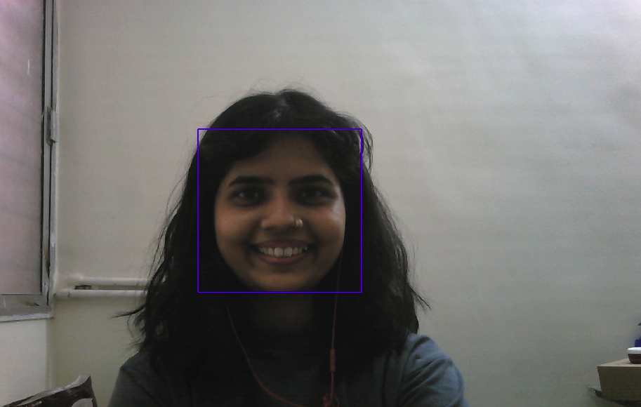

# Live Face detection on Jetson Nano

## Pre-requisites
- Jetson Nano Developer Kit (4GB variant)
- USB Camera
- Linux System 
- USB Data Cable
- 32GB SD Card and Card Reader

## Steps to install OS 
- Original Reference: https://developer.nvidia.com/embedded/jetson-nano-developer-kit
#### 1. Download SD Card image
- [Image Link](https://developer.download.nvidia.com/embedded/L4T/r32_Release_v7.1/JP_4.6.1_b110_SD_Card/Jeston_Nano/jetson-nano-jp461-sd-card-image.zip)

#### 2. Download Etcher 
- Download etcher for your system version
- Give executable permissions and run by running following command
  ```sh
  chmod +x balenaEtcher-1.14.3-x64.AppImage
  ./balenaEtcher-1.14.3-x64.AppImage
  ```
- Choose downloaded file and install OS on SDCard
#### 3. Install OS on Jetson Nano
- Insert SD-Card in Jetson Nano Board
- Connect Monitor, Keyboard, Mouse to Jetson Nano Board
- Power on Nano 
- Install OS and set username

## Access Jetson Nano without monitor
- Connect Camera to Jetson nano
- Connect Datacable to laptop and then Nano board and micro-usb slot
- Run this command from terminal to access the board. Use same username you used while installing us
  ```sh
  ssh username@192.168.55.1
  ```
  - Enter password you set it up in installation.
- Tadaa !! Accessed Jetson nano successfully with ssh access.

## Run live face detection application
- Clone the project repo
  ```sh
  git clone https://github.com/snehaa10/facedet-cam-jetsonnano.git
  cd facedet-cam-jetsonnano
  python3 facedet.py
  ```
- It will save output image on system (which will be overwritten)
  - and it will show the output on terminal.

- Output image

    


- Video to get overall idea: [Video Link](https://drive.google.com/file/d/1TD-zds7-f0S64pH5YuMqLuVLUOWPSnZu/view?usp=sharing)
